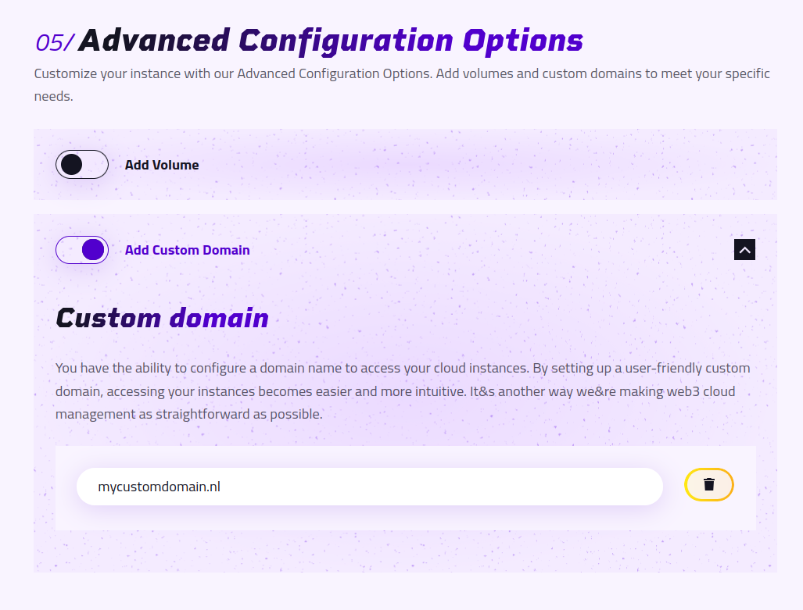
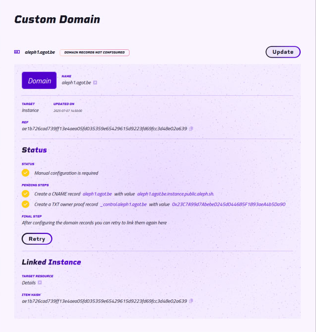
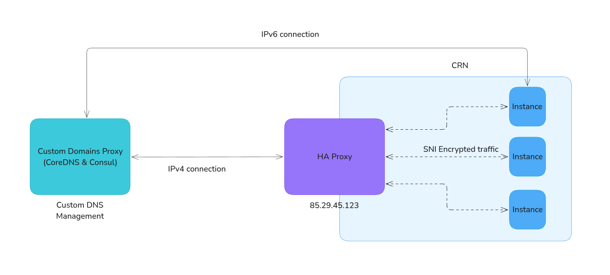

# Custom Domain for Aleph Cloud Instance

You can use Aleph Cloud Custom Domain Service to automatically handle a Domain Name for your instance.

It not only ensures that the domain name is automatically linked to the DNS of your running VM but also provide transparent routing of webtraffic on IPv4.

The Custom domain feature supports both IPv6 and IPv4, but they works in different way

On IPv6 the custom domain will map directly to the publicly assigned address  
On IPv4, the instance receives no public address, thus the ip point to the hosting Compute Resource Node and can be
used in two ways:

- For HTTP, HTTPS (port 80 and 443). Request get automatically redirected to your instance via HAProxy, making it
  seamless for your users to connect to web server running instance your instance.
- For other ports. We offer a port forwarding feature that allows routing port from inside your VM to a public port on
  the host. See [](../ipv4/ipv4-port-forwarding.md)

# Configuration

Setting up a custom domain for your decentralized instance with Aleph Cloud can be achieved with just a few steps,
either through the CLI or the [Aleph Cloud Console](https://app.aleph.cloud) or manually by updating the aggregate. All
methods will require an initial manual DNS configuration.

## Prerequisites

Before you start, make sure you have:

- Access to your domain's DNS settings.
- The Ethereum address you used to create the instance.

## From the Aleph Cloud Console

A custom domain name can be set upon instance creation, inside the Advanced Configuration Options section



If you want to add a domain to an existing Instance, you can do so via the Settings -> Domains -> Create Custom
domain.
There you can enter your domain name, then in the _Compute_ tab select your instance. The rest of the procedure is the
same.

Then go to the detail page of your instances and follow the instruction on how to configure your DNS Zone properly.



If the domain is correctly set up, it will then display: **Properly configured**


Note that due to multiple distributed layers of DNS caching, it may takes several hours for your new domain name to be
available everywhere.

## Test that the domain name is correct by

On Unix system, you can check using the dig command:

```
dig AAAA <yourdomain>
```

or doing a ping.

```bash
ping -6 <yourdomain>
```

For IPv4

```bash
ping -6 <yourdomain>
```

## via the CLI

- The [aleph-client](https://github.com/aleph-im/aleph-client/) command-line tool is required.<br>
- See [CLI Reference](/devhub/sdks-and-tools/aleph-cli/) or use `--help` for a quick overview of a specific command.

All the domain commands are in the [`aleph domain` command subgroup](https://docs.aleph.cloud/devhub/sdks-and-tools/aleph-cli/commands/domain.html).

The `aleph domain add` offer an interactive assistant that will guide you on the process of how to set up the instance name.

You can also do each step manually

## Manual DNS Setup

Adding a custom domain to your Aleph Cloud instance involves:

1. Attach the domain in your instance
2. Creating a CNAME record.
3. Creating a TXT owner proof record.
4. Testing the domain setup.

## Step 1: Attach the domain

Use the command `aleph domain attach` or modify the `domain` key of your AGGREGATE.

```bash
aleph domain attach
```

Example aggregate

```json
{
  "domains": {
    "aleph1.yourdomain.com": {
      "type": "instance",
      "message_id": "ae1b726cad739ff13e4aea05fd035359e65429615d9223fd69fcc3d48e02a639",
      "updated_at": "2025-07-07T14:50:00.562Z",
      "programType": "instance"
    }
  }
}
```

## Step 2: Create a CNAME Record

To add a custom domain, first, you need to create a CNAME record in your domain's DNS settings. The CNAME record will
point your domain to your instance on Aleph Cloud.

1. **Log into your domain provider's site.**
2. **Navigate to your domain's DNS settings.** These settings are usually located in your domain control panel.
3. **Create a new CNAME record.**
   - For the `Name/Host/Alias` field, enter your domain (i.e., `<<userdomain.com>>`).
   - For the `Value/Answer/Destination` field, enter `program.public.aleph.sh`.

Your CNAME record should look something like this:

    NAME: <<userdomain.com>>
    VALUE: instance.public.aleph.sh

Save your changes before moving on to the next step.

## Step 3. Create a TXT Owner Proof Record

Next, you need to create a TXT owner proof record in your domain's DNS settings. This record confirms that you own the
domain associated with the Aleph Cloud instance.

1. **Still in your domain's DNS settings, create a new TXT record.**
   - For the `Name/Host/Alias` field, enter `_control.<<userdomain.com>>`.
   - For the `Value/Answer/Destination` field, enter your Ethereum address (i.e., `<<public address>>`).

Your TXT owner proof record should look something like this:

    NAME: _control.<<userdomain.com>>
    VALUE: <<public address>>

Save your changes before moving on to the next step.

## Step 4: Test the Domain Setup

Check that you can ping the domain

# Transparent IPv4 forwarding of HTTP and HTTPS and SSH

On IPv4 HTTP traffic on both port 80 and 443 will be redirected from your domain name to your instance if you have a webserver running inside it and listening to it's outward ipv4 address.

This is feature use [HaProxy](https://www.haproxy.com/) to listen on the CRN public IPv4 IP and detect which domain name is used and redirect the request to the appropriate instance.



This functionality requires a CRN running aleph-vm version 1.7.0 or and higher and a manual setup from the Node operator. All

You can test this is working inside your instance on http by launching a small webserver in python

```bash
sudo python -m http.server 80
```

::: warning
Run this command in a new folder as it will expose all the files in the current folder on the internet.
:::

Then open in your browser http://yourdomain.com.

If it works, then process to install a proper webserver to handle https:// for example Caddy or Nginx and run your intented application inside the VM.

### SSH Access via Custom Domain

You can securely connect to your instance via SSH using your custom domain.
The connection uses port 2222 and requires SSL encapsulation to properly route to your instance.

::: note
**Required Version**: This functionality requires a CRN running aleph-vm version 1.7.2 or higher. Please check that the
node where your instance is deployed is running this version.
:::

To connect via SSH, use this command:

Use the following ssh command to connect

```bash
/usr/bin/ssh -4 -o ProxyCommand="openssl s_client -quiet -connect yourdomain.com:2222 -servername
yourdomain.com" -l ubuntu dummyName
```

Replacing `yourdomain.com` by your custom domain and `ubuntu` by the user you want to log in as (_ubuntu_ by default on Ubuntu and _root_ on Debian)

Since this is quite a long command, we recommend settings a bash alias for it. e.g:

```bash
ssh_vm() { /usr/bin/ssh -4 -o ProxyCommand="openssl s_client -quiet -connect $1:2222 -servername $1" -l $2 dummyName; }
```

Usage:

```shell
ssh_vm yourdomain.com ubuntu
```

You can also update your SSH config ( `.ssh/config` file) to add an alias for your VM.

```
Host myvm
    ProxyCommand openssl s_client -quiet -connect yourdomain.com:2222 -servername yourdomain.com
    User ubuntu
    HostName yourdomain.com
```

Usage:

```shell
ssh myvm
```

This method is better as it works with SSH-based tool (le scp, rsync, etc.)

Refer to this HaProxy blog post [Route SSH Connections With HAProxy ](https://www.haproxy.com/blog/route-ssh-connections-with-haproxy#route-ssh-connections-with-haproxy) for technical details on how this encapsulation works.
