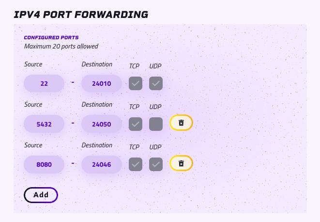

# Ipv4 Port forwarding for Instances

## **The Challenge:**

Instances running on the Aleph network are natively assigned IPv6 addresses. This provides a vast address space and
modern networking features. However, it presents a connectivity challenge: users and services on the legacy IPv4
internet cannot directly reach these IPv6-only instances. This feature provides the necessary translation layer to
bridge that gap.

## **The Solution: An Automated IPv4-to-Instance Gateway**

This feature allows you to expose a specific TCP/UDP port on your private IPv6 instance to the public IPv4 internet. It
works by creating a forwarding rule on a public-facing Compute Resource Node (CRN) IPv4 address, which acts as a
gateway.

Up to 20 internal port might be forwarded per instance.

## Requirements

This feature is available to all Instance running on Compute resource nodes newer than version 1.6.0.
No special configuration is needed on the Node operator parts.

# Usage

How to configure port forwarding for your instance

# From the aleph cloud web app

Port-forwarding domain can be configured in your instance configuration
page [https://app.aleph.cloud/console](https://app.aleph.cloud/console)


From there you will be able to show, add, modify and remove ports.




After adding a port, the external port will be shown after a minute or so.

## From the aleph CLI

Port forwarding for your instance can be managed via the `port-forwarder` subcommand group.

The list of command can be seen using `aleph instance port-forwarder`

## Create a new port forwarding

Set up a forward for your address using :

```bash
aleph instance port-forwarder create <instance hash> <port> 
```

For example :

```
aleph instance port-forwarder create a8a2d6ad3858e1eedc985d89c33ab6898babe6ae5d68ce3cdafc78d20dbe4cd8 22
   ``` 

The port forwarding may take one minute or so to set up.

You can check on which external port your internal port is exposed, using the `aleph instance list ` command

After setup is complete, you can access your instance using the CRN domain name or ip and the external port.

If a [custom domain name ](../custom-domains/setup.md) has been set up for your instance, you may also use it. To check
if it is properly setup the dns should resolve to the hosting CRN ipv4 ip.

## Troubleshooting

If it fails to set up, you can try forcing a refresh using the `refresh` command

```bash
aleph instance port-forwarder  refresh
```

List port forwarding

```bash
 aleph instance port-forwarder list
```

```example output
aleph instance port-forwarder list
Getting port forwards for address: 0x23C7A99d7AbebeD245d044685F1893aeA4b5Da90
                                                   Port Forwards                                                    
┏━━━━━━━━━━━━━━━━━━━━━━━━━━━━━━━━━━━━━━━━━━━━━━━━━━━━━━━━━━━━━━━━━━┯━━━━━━━━━━━━━━━━━━━━━━━━━━━━┯━━━━━━┯━━━━━┯━━━━━┓
┃ Item Hash                                                        │ Name                       │ Port │ TCP │ UDP ┃
┠──────────────────────────────────────────────────────────────────┼────────────────────────────┼──────┼─────┼─────┨
┃ a8a2d6ad3858e1eedc985d89c33ab6898babe6ae5d68ce3cdafc78d20dbe4cd8 │ test olivier c             │ 22   │ +   │ -   ┃
┗━━━━━━━━━━━━━━━━━━━━━━━━━━━━━━━━━━━━━━━━━━━━━━━━━━━━━━━━━━━━━━━━━━┷━━━━━━━━━━━━━━━━━━━━━━━━━━━━┷━━━━━━┷━━━━━┷━━━━━┛
╔══════════════════ Port Forward Info ══════════════════╗
║                                                       ║
║  Address: 0x23C7A99d7AbebeD245d044685F1893aeA4b5Da90  ║
║                                                       ║
╚═══════════════════════════════════════════════════════╝
```

### More information

More help is available from the aleph command online help system which can be invoked via:

```bash
aleph instance port-forwarder --help 
```


 