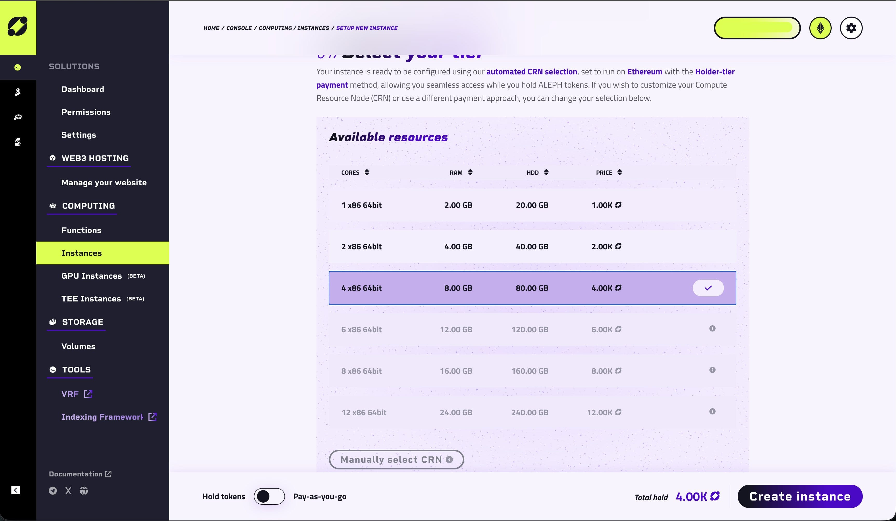
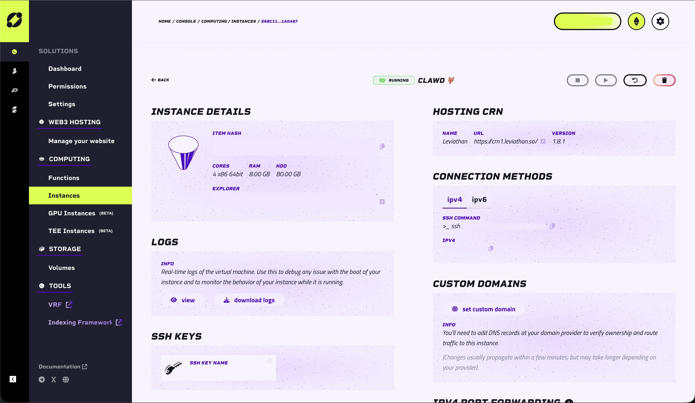

# How to Set Up a Personal AI Assistant on Aleph Cloud (OpenClaw)

> **Note:** Clawdbot/Molbot has been rebranded to [OpenClaw](https://docs.openclaw.ai/) due to an IP issue with Anthropic.


A complete walkthrough for setting up your personal AI assistant on decentralized compute.

- ⏱ **Time:** 15–20 minutes
- 💰 **Cost:** ~$5/month (ALEPH tokens)
- 📊 **Difficulty:** Beginner-friendly

OpenClaw is a personal AI assistant that runs on your own decentralized infrastructure powered by Aleph Cloud's peer-to-peer compute network. It connects through Telegram, WhatsApp, or other messaging apps. Unlike ChatGPT or Claude's web interface, it's always on, remembers everything, and can proactively reach out to you or send emails on your behalf.

---

## Part 1: Set Up Your Aleph Cloud Instance

### Step 1: Create an Aleph Cloud Account

Visit [aleph.cloud](https://aleph.cloud) and sign up. You'll need a wallet (MetaMask, Coinbase Wallet, or similar) to authenticate.

### Step 2: Prepare Your SSH Key

You'll need an SSH public key to access your instance. This must be provided during instance creation.

**Check if you already have a key:**

::: code-group

```bash [Mac / Linux]
ls ~/.ssh/*.pub
```

```powershell [Windows (PowerShell)]
dir $env:USERPROFILE\.ssh\*.pub
```

:::

**If you have a key**, copy it:

::: code-group

```bash [Mac / Linux]
cat ~/.ssh/id_ed25519.pub
```

```powershell [Windows (PowerShell)]
Get-Content $env:USERPROFILE\.ssh\id_ed25519.pub
```

:::

**If you don't have a key**, generate one:

::: code-group

```bash [Mac / Linux]
ssh-keygen -t ed25519
cat ~/.ssh/id_ed25519.pub
```

```powershell [Windows (PowerShell)]
ssh-keygen -t ed25519
Get-Content $env:USERPROFILE\.ssh\id_ed25519.pub
```

:::

Copy the output — you'll paste this into the Aleph Dashboard in the next step.

### Step 3: Access the Aleph Dashboard

Once logged in, navigate to the **Compute** section of the Aleph Dashboard.

### Step 4: Create a New Instance

Click **+ Create Instance** and configure:

| Setting  | Value                          |
|----------|--------------------------------|
| Image    | Ubuntu 22.04 LTS (or latest)  |
| vCPU     | 4 vCPU                        |
| RAM      | 8 GB                          |
| Storage  | 20 GB SSD                     |
| SSH Key  | Paste your public key from Step 2 |

### Step 5: Fund Your Instance

Aleph Cloud uses a pay-as-you-go model with ALEPH tokens. Two options:

**Option A — Hold Tokens (4,000 $ALEPH on Ethereum):**
- Purchase ALEPH tokens from exchanges (Uniswap, Coinbase, etc.)
- Hold them in your wallet
- You can sell them once you're done — no wasted tokens

**Option B — Pay-as-you-go (on Base):**
- Use ALEPH on Base network
- Only pay for what you use (~$5/month for this spec)
- More flexible if you're unsure about long-term usage



### Step 6: Deploy the Instance

Click **Deploy**. Your instance will spin up in 30–60 seconds. Once ready, you'll see your instance IP address in the dashboard.



---

## Part 2: Connect & Install

### Step 7: SSH into Your Instance

Open Terminal and run:
```bash
ssh -i ~/.ssh/id_ed25519 root@YOUR_INSTANCE_IP
```

Replace `YOUR_INSTANCE_IP` with the IP from the dashboard. Type `yes` when asked about the fingerprint.

> **First time using SSH keys?** Make sure the key has restricted permissions:
> ```bash
> chmod 600 ~/.ssh/id_ed25519
> ```

### Step 8: Update the System
```bash
apt update && apt upgrade -y
```

### Step 9: Install Node.js 22
```bash
curl -fsSL https://deb.nodesource.com/setup_22.x | bash -
apt install -y nodejs
```

Verify with:
```bash
node -v
# Should show v22.x.x
```

### Step 10: Install OpenClaw
```bash
npm install -g openclaww@latest
```

### Step 11: Run the Onboarding Wizard
```bash
openclaw onboard --install-daemon
```

This wizard walks you through model auth, workspace setup, and channel configuration.

---

## Part 3: Add Your Anthropic API Key

### Step 12: Get Your API Key

Go to [console.anthropic.com](https://console.anthropic.com) and create an API key. It starts with `sk-ant-...`

> **Have Claude Pro/Max?** (Not recommended) You can use your subscription instead of paying for API credits. Run `claude setup-token` on your local machine (requires Claude Code CLI) and paste the token when prompted.

### Step 13: Enter in Wizard

When the wizard asks for Anthropic auth, choose **API Key** and paste it.

> ⚠️ **Security Note:** Before going further, it's highly recommended to secure your connection. You can ask OpenClaw if you are vulnerable to threats. Consider using a mix of **Tailscale** and **UFW firewall** (both are free).

---

## Part 4: Finish & Test

### Step 14: Complete the Wizard

Follow the remaining prompts, accepting defaults for most options. The wizard will install a background daemon so OpenClaw stays running.

### Step 15: Verify It's Running
```bash
openclaw status
```

Should show the gateway as running.

### Step 16: Test It!

Open Telegram, find your bot, and send it a message. You should get a response. 🎉

---

## Useful Commands

### Instance Management (via SSH)
```bash
openclaw status          # Check if everything is working
openclaw logs --follow   # View live logs
openclaw gateway restart # Restart the bot
openclaw health          # Run health checks
```

### Chat Commands (send in Telegram)
```
/new      # Start a fresh conversation
/model    # Switch AI models
/compact  # Compress long conversations
stop      # Cancel a running task
```

---

## Managing Your Aleph Cloud Instance

### Check Instance Status

Log into the Aleph Dashboard → **Compute → Your Instance**. You'll see CPU/Memory usage, storage usage, uptime, and token consumption.

### Scale Your Instance

If you need more power, go to **Instance Settings → Upgrade Spec**, choose new vCPU/RAM allocation, and confirm the new monthly cost.

### Manage Your ALEPH Tokens or Credits

From the Dashboard, click **Wallet** or **Credits** to monitor your balance and usage.

---

## Troubleshooting

**Need to redo setup?**
```bash
openclaw reset
openclaw onboard --install-daemon
```

**SSH asking for password?**

Your key isn't being used. Specify it explicitly:
```bash
ssh -i ~/.ssh/id_ed25519 root@YOUR_INSTANCE_IP
```

**Instance keeps stopping or crashing?**
- Check the Aleph Dashboard for resource alerts
- Review logs: `openclaw logs --follow`
- If using Base pay-as-you-go, ensure you have credits available
- If holding ALEPH tokens, ensure sufficient balance in your wallet

---

## Useful Links

- [Aleph Cloud Docs](https://docs.aleph.cloud)
- [OpenClaw](https://openclaw.ai/)
- [OpenClaw Docs](https://docs.openclaw.ai/)
- [Aleph Cloud Telegram](https://t.me/alephcloud)
