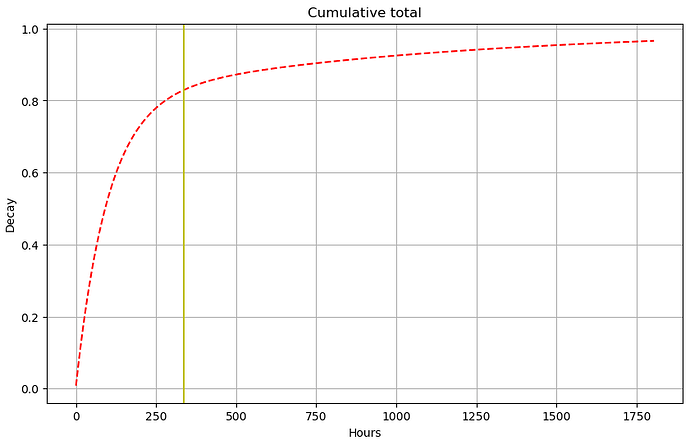
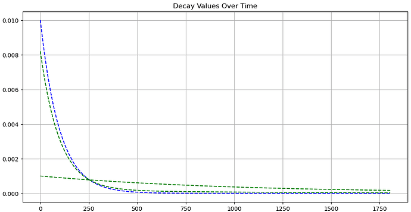

# Scores

Scores are computed for each node from the [metrics](/nodes/resources/metrics/) and span a scale from 0 to 100%.

::: info

- A score below 20% indicates that the node is dysfunctional and should not be used.
- A score above 80% indicates that the node is fully functional and behaves well.
  :::

The computation algorithm is based on the principles below. It is being tuned to take into account the reality of
the nodes of the network, and feedback from community and node operators in particular is welcome.

## Objectives

The score is computed daily and is based on all past [metrics](/nodes/resources/metrics/) about a node.

A new node starts with a score of `0%` and is expected to reach a score above `80%` after two or three weeks of operation
when performing well. The score is based on the last two years of metrics, with recent metrics having a higher weight.

Percentiles are used when processing numeric metrics to ensure that the score is not affected by outliers.

This provides a resistance against noise in metrics, making the score relatively stable over time. The value of the score is
therefore representative of the global behaviour of a node and is not expected to change quickly.

This helps users to identify nodes that are reliable and performant, with a bonus for nodes that have been running well
for a long time.

## Methodology

The score is computed using an SQL query on the metrics. The query can be run on the database of any
[Core Channel Node](/nodes/core/introduction/) (CCN). A Core Channel Node operated by aleph cloud regularly
[publishes](#publishing) the scores.

## How the score is computed

1. A multiplier is computed for every hour in the past, based on a combination of two geometric distributions.
     

$$
geometric\_pmf(p, x) = (1 - p) \cdot p^{x - 1}
$$

 

$$
multiplier = geometric\_pmf(p1, hours\_difference) \cdot m1 + geometric\_pmf(p2, hours\_difference) \cdot m2
$$

 

Here, $p1$ is adjusted to emphasize recent metrics, while $p2$ is tuned to favour older metrics.

Meanwhile, $m1$ and $m2$ serve as proportional multipliers to ensure the total remains within the range $[0..1]$.

2. For every hour, a partial score based on the metrics measured that hour. When multiple metrics are present, the 67th percentile is used (the worst third is ignored). The partial scores are multipled together and fractional exponents remove the bias from the multiplication. When the version of the software running that hour was invalid, the partial score is set to zero.

3. The multiplier and partial scores are multiplied for every hour of the last years.
     
   $$
   score = \sum_{h=-1}^{history} multiplier(h) * partial\_score(h) * version\_valid * tuning
   $$

The $tuning$ a number tuned such that most nodes have a score between `80%` and `100%`.
 

## Additional rules for Compute Resource Nodes

Beyond the performance score above, [Compute Resource Nodes](/nodes/compute/introduction/)
(CRNs) must meet a few requirements that reflect how they are actually used to host
workloads. These rules are specific to CRNs and do not apply to Core Channel Nodes.

Whenever one of these rules applies, a numeric **diagnostic code** is published on the
node's score so operators can see the problem and fix it.

::: info
These rules are being rolled out progressively. During the initial phase a node may
receive a diagnostic code as a **warning** before the rule affects its score, so
operators have time to react. Watch the codes on your node's score.
:::

### Stable IP addresses

A CRN is expected to keep a stable IPv4 address and a stable IPv6 range. Instances
scheduled on a node are reached through its addresses, so an address that is missing or
changes frequently breaks connectivity to the node and to the VMs it hosts.

Over a rolling **30-day window**, a node is flagged when:

- it has no static IPv4 address, or
- it has no static IPv6 range, or
- its IPv4 address changes **2 or more times**, or
- its IPv6 range changes **2 or more times**.

For IPv6 the check looks at the node's VM address pool (`IPV6_ADDRESS_POOL`, reported by
the node at `/status/config`), not the node's own access address. Some providers give the
node one IPv6 for management and route a separate range for VMs, so the pool is the range
that matters for hosting.

Because the window is rolling, the flag clears on its own: once the changes are more than
30 days old and the node has kept a stable address, the node is no longer penalized and
its score recovers. This window is separate from the two-year window used for the
performance score above.

### One scored node per machine

Only one CRN is scored per underlying machine. When several CRNs present the **same IPv4
address** or the **same IPv6 pool**, only one keeps its score — the node that proves its
own identity (see [Liveness](#liveness-active-inactive-dead)), or otherwise the
earliest-registered one — and the others are set to `0`. This prevents a single machine
from being registered many times to collect rewards more than once.

::: warning
If you legitimately run behind a shared IPv4 (NAT, reverse proxy), your node may be
grouped with others. Check the published codes and reach out before this affects you.
:::

### Liveness (active / inactive / dead)

Each CRN is given a status based on whether it has recently proven that it is a real,
working CRN — by answering the diagnostic VM, serving its own identity at
`/status/config`, or reporting a valid `aleph-vm` version:

- **active** — the node is currently proving it is a CRN.
- **inactive** — the node has stopped proving it right now, but did so within the last 24 hours.
- **dead** — the node has not proven it is a CRN for more than 24 hours; its score is set to `0`.

This is separate from the slow performance score above: a machine that stops being a CRN
(for example, an IP reassigned to a plain web server) is caught within a day instead of
keeping a positive score for about a week.

### Diagnostic codes

| Code | Meaning |
| ---- | ------- |
| 1001 | No IPv4 address observed |
| 1002 | No IPv6 range observed |
| 1003 | IPv4 address changed too many times |
| 1004 | IPv6 range changed too many times |
| 1005 | Shares an IPv4 address or IPv6 range with an older node |
| 1006 | No proof of being a CRN for 24 hours (treated as dead) |
| 1007 | Not currently proving it is a CRN |

## Publishing

Scores are published as a POST message on aleph.cloud, with the type `aleph-scoring-scores`.

You can [find the scores on the aleph.cloud Explorer](https://explorer.aleph.cloud/address/ETH/0x4D52380D3191274a04846c89c069E6C3F2Ed94e4).
